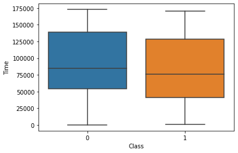
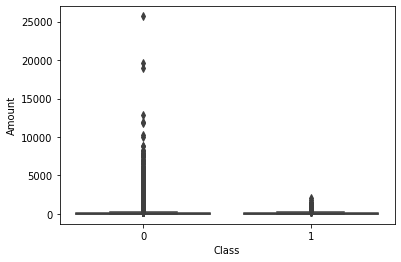
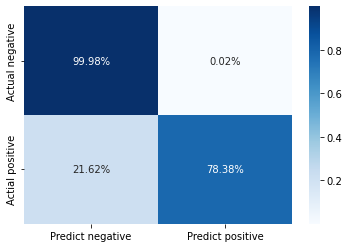

***

# Fraud Detection using Random Forest

*Posted on October 2022*

***

In this notebook I would like to implement fraud detection using random forest as its framework. The data I will use is provided by Aman Chauhan in [here](https://www.kaggle.com/datasets/whenamancodes/fraud-detection).

The data consist of 31 columns with one column act as a class, one column is how long it takes for the user to input, and the other 29 is an output of a PCA transformation. Unfortunately, due to confidentiality the source cant provided any further information about the output of a PCA.

First thing to do is load the data and look for any pattern


```python
import pandas as pd
import seaborn as sb
```


```python
path_data = '../input/fraud-detection/creditcard.csv'

df = pd.read_csv(path_data)
```


```python
df.dtypes
```


    Time      float64
    V1        float64
    V2        float64
    V3        float64
    V4        float64
    V5        float64
    V6        float64
    V7        float64
    V8        float64
    V9        float64
    V10       float64
    V11       float64
    V12       float64
    V13       float64
    V14       float64
    V15       float64
    V16       float64
    V17       float64
    V18       float64
    V19       float64
    V20       float64
    V21       float64
    V22       float64
    V23       float64
    V24       float64
    V25       float64
    V26       float64
    V27       float64
    V28       float64
    Amount    float64
    Class       int64
    dtype: object


```python
df.isna().sum()
```


    Time      0
    V1        0
    V2        0
    V3        0
    V4        0
    V5        0
    V6        0
    V7        0
    V8        0
    V9        0
    V10       0
    V11       0
    V12       0
    V13       0
    V14       0
    V15       0
    V16       0
    V17       0
    V18       0
    V19       0
    V20       0
    V21       0
    V22       0
    V23       0
    V24       0
    V25       0
    V26       0
    V27       0
    V28       0
    Amount    0
    Class     0
    dtype: int64


As we can see there are no missing values on the data


```python
sb.boxplot(data=df, x="Class", y="Time")
```


    <AxesSubplot:xlabel='Class', ylabel='Time'>


    

    


Here we can see that between an input that considered a fraud and non-fraud, there is no particular difference in time features. With this in mind, I then remove time features from our detection model


```python
sb.boxplot(data=df, x="Class", y="Amount")
```


    <AxesSubplot:xlabel='Class', ylabel='Amount'>


    

    


Here is the same boxplot analysis but for different feature which is amount. Visually, we can a clear different between fraud and non-fraud input.


```python
df['Class'].value_counts()
```


    0    284315
    1       492
    Name: Class, dtype: int64


The dataset is considered unbalanced because there are 284315 non-fraud data while there are only 492 data that can be considered as fraud. With this in mind, I will incorporate weighting to the random forest model.


```python
y = df['Class']
X = df.drop(['Class', 'Time'], axis=1)
```

Next, I divide the data into training and test data


```python
from sklearn.model_selection import train_test_split

X_train, X_test, y_train, y_test = train_test_split(X, y, test_size=0.33, random_state=1)
```

Our amount feature is still in the range that is not the same as any other features, so we need to scale this feaure.


```python
from sklearn.compose import ColumnTransformer
from sklearn.preprocessing import RobustScaler

column_trans = ColumnTransformer(
    [('Scaler', RobustScaler(), X_train.columns)])

X_train = column_trans.fit_transform(X_train)
X_test = column_trans.transform(X_test)
```

I use grid search to find the best parameter for the model


```python
# grid search
from sklearn.ensemble import RandomForestClassifier
from sklearn.model_selection import GridSearchCV
from sklearn.metrics import f1_score, make_scorer

scorer = make_scorer(f1_score)

params = {"criterion": ["gini", "entropy"],
          "max_depth": [8, 4],
          "class_weight": ["balanced", "balanced_subsample"]
          }

grid = GridSearchCV(estimator=RandomForestClassifier(), param_grid=params, error_score='raise', scoring=scorer)
grid.fit(X_train, y_train.values)
print(grid.best_score_)
print(grid.best_estimator_)
```

    0.8472833881463154
    RandomForestClassifier(class_weight='balanced_subsample', criterion='entropy',
                           max_depth=8)
    

The best parameter for the random forest model turn out to be 8 depth random forest, with entropy as its criterion and balanced subsample to weight the unbalance dataset

Lets use this parameter as our parameter in the actual model


```python
from sklearn.metrics import f1_score
from sklearn.pipeline import Pipeline

# define the model
model = Pipeline([('RandomForest', RandomForestClassifier(class_weight='balanced_subsample', criterion='entropy',max_depth=8)),
                  ])
model.fit(X_train, y_train)
# predict on test set
yhat = model.predict(X_test)
# evaluate predictions
f1 = f1_score(y_test, yhat)
print('F1 score: {}'.format(f1))
```

    F1 score: 0.8169014084507041
    

This give us a fraud detection model with F1 score of about 0.81


```python
from sklearn.metrics import classification_report

print(classification_report(y_test, yhat))
```

                  precision    recall  f1-score   support
    
               0       1.00      1.00      1.00     93839
               1       0.85      0.78      0.82       148
    
        accuracy                           1.00     93987
       macro avg       0.93      0.89      0.91     93987
    weighted avg       1.00      1.00      1.00     93987
    
    


```python
from sklearn.metrics import confusion_matrix

cm = pd.DataFrame(confusion_matrix(y_test, yhat))
cm.columns = ['Predict negative', 'Predict positive']
cm.index = ['Actual negative', 'Actial positive']
cm.iloc[0] = cm.iloc[0]/cm.sum(axis=1)[0]
cm.iloc[1] = cm.iloc[1]/cm.sum(axis=1)[1]

sb.heatmap(cm, annot=True, cmap='Blues', fmt='.2%')
```


    <AxesSubplot:>


    

    


The performance of the model can also be viewed as a confusion matrix. As you can see the model successfully predict 99.98% of the non-fraud data and 78.38% of the fraud data.
